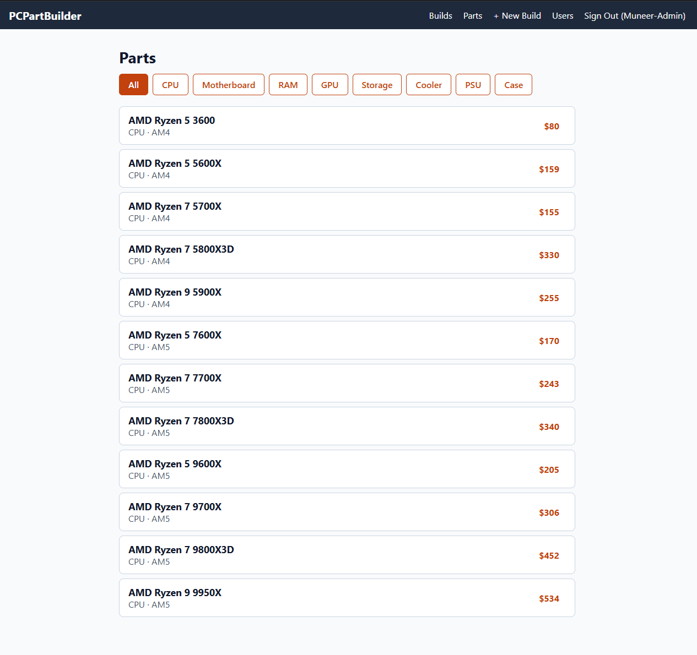
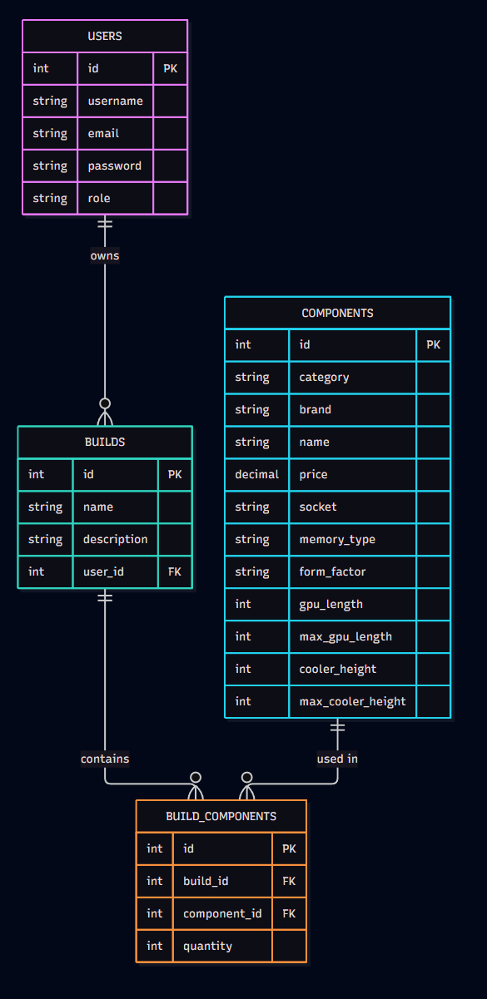
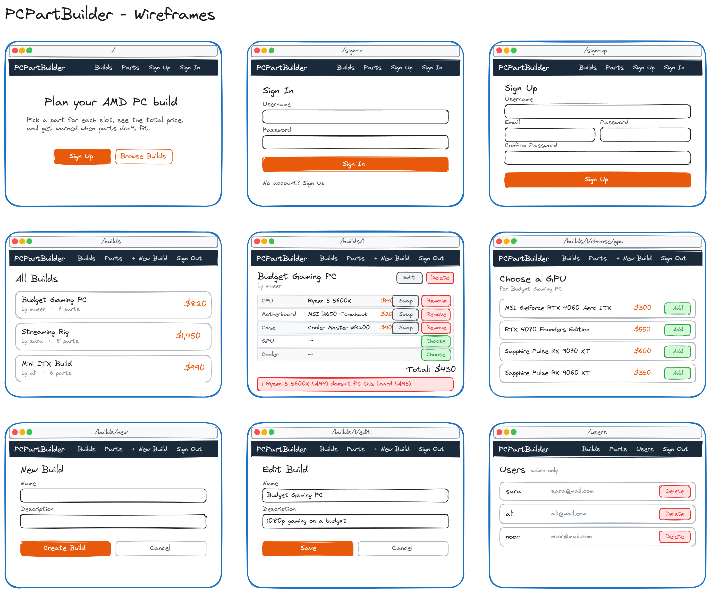

# PCPartBuilder



PCPartBuilder is a planner for AMD desktop PC builds. You create a build, pick a part for each slot (CPU, motherboard, RAM, GPU, storage, cooler, power supply and case), and the app adds up the total price. It warns you when parts don't fit together: a CPU in the wrong socket, the wrong type of RAM, a GPU too long for the case, or a cooler too tall for it.

I built it because I enjoy planning PC builds and wanted a simple tool that catches the mistakes that are easy to make when choosing parts.

## Getting Started

- Deployed app: [pc-part-builder-front-end.vercel.app](https://pc-part-builder-front-end.vercel.app)
- Back-end repository: [pc-part-builder-back-end](https://github.com/Munnerha/pc-part-builder-back-end)
- Planning materials: [user stories, ERD, wireframes and routes](#planning)

Anyone can browse builds and parts. Sign up to create your own builds.

## Technologies Used

- JavaScript, React and React Router
- Vite
- CSS with Flexbox and Grid
- react-icons
- Python, FastAPI, SQLAlchemy and Alembic
- PostgreSQL
- JWT authentication
- Vercel (front end), Render (back end) and Neon (database)

## Attributions

- Icons from [Bootstrap Icons](https://icons.getbootstrap.com/), used through [react-icons](https://react-icons.github.io/react-icons/)
- Part names and specs based on [docyx/pc-part-dataset](https://github.com/docyx/pc-part-dataset) and manufacturer spec pages
- Inspired by [PCPartPicker](https://pcpartpicker.com/)

## Next Steps

- Check that the motherboard's size fits the case
- Estimate a build's power draw and warn when the power supply is too weak
- Hide parts that don't fit when choosing a part
- Let the admin add and edit parts in the catalog
- Product photos for parts

## Planning

## User Stories

- As a guest, I want to browse builds and parts.
- As a user, I want to sign up, sign in and sign out.
- As a user, I want to create, edit and delete my builds.
- As a user, I want to add, swap and remove parts in my build.
- As a user, I want to see my build's total price.
- As a user, I want a warning when my parts don't fit together (socket, RAM, GPU length, cooler height).
- As an admin, I want to delete any user or build.





## Routes / Endpoints

### Back End (`/api`)

#### Auth
| Method | Endpoint | Access |
|---|---|---|
| POST | `/register` | Everyone |
| POST | `/login` | Everyone |

#### Components
| Method | Endpoint | Access |
|---|---|---|
| GET | `/components` | Everyone |

#### Builds
| Method | Endpoint | Access |
|---|---|---|
| GET | `/builds` | Everyone |
| GET | `/builds/{build_id}` | Everyone |
| POST | `/builds` | Signed in |
| PUT | `/builds/{build_id}` | Owner |
| DELETE | `/builds/{build_id}` | Owner or admin |

#### Build Components
| Method | Endpoint | Access |
|---|---|---|
| POST | `/builds/{build_id}/build_components` | Owner |
| PUT | `/build_components/{build_component_id}` | Owner |
| DELETE | `/build_components/{build_component_id}` | Owner |

#### Users
| Method | Endpoint | Access |
|---|---|---|
| GET | `/users` | Admin |
| DELETE | `/users/{user_id}` | Admin |

### Front End

| Path | Page |
|---|---|
| `/` | Landing |
| `/sign-up` | Sign up |
| `/sign-in` | Sign in |
| `/builds` | All builds |
| `/builds/new` | New build |
| `/builds/:buildId` | Build details |
| `/builds/:buildId/edit` | Edit build |
| `/builds/:buildId/choose/:category` | Pick a part |
| `/components` | Parts catalog |
| `/users` | Users (admin) |

## Component Hierarchy

```
App
├── NavBar
├── Landing
├── SignUpForm
├── SignInForm
├── BuildList
├── BuildDetails
├── BuildForm
├── PartList
└── UserList
```